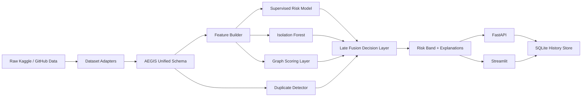

# AEGIS Full Technical Report

Generated from the current workspace state on 2026-03-26.

## 1. Project Summary

AEGIS is a predictive fraud intelligence system for supply-chain and transaction-finance screening. It is designed to score fraud risk before disbursement by combining:

- supervised fraud classification
- anomaly detection
- duplicate financing detection
- graph-based relationship scoring
- explainable decision output

The application stack in this workspace contains:

- a Python modeling layer in `aegis/`
- a FastAPI backend in `backend/main.py`
- a Streamlit operator console in `streamlit_app.py`
- SQLite persistence for training runs, dataset imports, and predictions
- ingestion and normalization pipelines for Kaggle and GitHub open datasets

Current runtime status:

- FastAPI backend is running at `http://127.0.0.1:8000`
- Streamlit UI is running at `http://localhost:8501`
- backend health check returned `{"status":"ok"}`
- full test suite status: `8 passed`

## 2. High-Level Architecture



## 3. Core Objective

The project is optimized for early fraud screening, not post-facto audit. The model tries to identify:

- cross-lender duplicate financing
- buyer-supplier collusion
- unusual transaction behavior
- dense or suspicious network relationships
- invoice inflation or short-term stress patterns

## 4. Data Assets and Prepared Datasets

### 4.1 Open-source source catalog

The project catalog includes:

| Source | Provider | Role in project |
| --- | --- | --- |
| IEEE-CIS Fraud Detection | Kaggle | optional large fraud benchmark |
| Credit Card Fraud Detection (MLG-ULB) | Kaggle | rare-event fraud benchmark |
| PaySim Mobile Money Fraud | Kaggle | behavioral anomaly benchmark |
| Elliptic++ | GitHub | graph-centric illicit transaction benchmark |
| DataCo Supply Chain Analytics | GitHub | supply-chain context and entity behavior |

### 4.2 Prepared datasets currently on disk

| Dataset | Rows | Fraud rows | Fraud rate | Notes |
| --- | ---: | ---: | ---: | --- |
| `dataco_aegis.csv` | 162,200 | 0 | 0.0000 | operational supply-chain context only |
| `elliptic_aegis.csv` | 203,769 | 4,545 | 0.0223 | graph-heavy illicit transaction proxy |
| `creditcardfraud_aegis.csv` | 284,807 | 492 | 0.0017 | severe imbalance benchmark |
| `paysim_aegis.csv` | 6,362,620 | 8,213 | 0.0013 | large behavioral fraud benchmark |
| `dataco_hybrid_aegis.csv` | 60,000 | 8,400 | 0.1400 | real supply-chain rows plus injected fraud |
| `multisource_open_aegis_32000.csv` | 32,000 | 6,928 | 0.2165 | blended open-source experimental set |

### 4.3 Fraud-type composition

`dataco_hybrid_aegis.csv`:

- `legit`: 51,600
- `duplicate_financing`: 3,780
- `buyer_supplier_collusion`: 2,520
- `rapid_network_expansion`: 2,100

`multisource_open_aegis_32000.csv`:

- `legit`: 25,072
- `crypto_illicit_flow`: 2,688
- `mobile_money_fraud`: 1,584
- `card_payment_fraud`: 896
- `duplicate_financing`: 770
- `buyer_supplier_collusion`: 543
- `rapid_network_expansion`: 447

Open-blend source allocation:

- `elliptic`: 9,600
- `paysim`: 8,800
- `dataco_hybrid`: 8,000
- `creditcardfraud`: 5,600

## 5. Training Workflows

### 5.1 Standard training flow

The training logic in `aegis/service.py` follows this sequence:

1. Load or generate a dataset.
2. Normalize it into the AEGIS schema.
3. Split with `train_test_split(test_size=0.2, random_state=42, stratify=is_fraud)`.
4. Train a validation model on the training split.
5. Score the holdout split and compute fraud-native metrics.
6. Refit a final model on the full dataset.
7. Save the bundle to `artifacts/models/aegis_bundle.joblib`.
8. Record the run in SQLite.

### 5.2 Current artifact state

There are two important recent training runs in history:

#### Active default bundle on disk

- source: `dataco_hybrid`
- rows: `60,000`
- fraud rows: `8,400`
- artifact path: `artifacts/models/aegis_bundle.joblib`

This is the model currently loaded by the backend and Streamlit app.

#### Recent experimental run in history

- source: `multisource_open_blend_32000`
- rows: `32,000`
- fraud rows: `6,928`
- recorded in SQLite history

This run is useful as a more realistic multi-domain benchmark, but it is not the currently loaded artifact.

## 6. Model Performance

### 6.1 Active default bundle metrics

These metrics are stored on the current artifact and match the latest `dataco_hybrid` training run:

| Metric | Value |
| --- | ---: |
| ROC AUC | 1.0000 |
| Average Precision | 1.0000 |
| Precision @ top 10% | 1.0000 |
| Recall @ top 10% | 0.7143 |
| Fraud rate in dataset | 0.1400 |

Additional reproduced holdout metrics using the same training/evaluation logic:

| Metric | Value |
| --- | ---: |
| Accuracy | 0.9600 |
| F1 score | 0.8333 |
| Operational threshold | 0.7724 |

Confusion matrix on the holdout split:

- true negatives: `10,320`
- false positives: `0`
- false negatives: `480`
- true positives: `1,200`

### 6.2 Multi-source open-dataset experiment metrics

This is the more diverse cross-domain run recorded in history:

| Metric | Value |
| --- | ---: |
| ROC AUC | 0.9087 |
| Average Precision | 0.6953 |
| Precision @ top 10% | 0.7457 |
| Recall @ top 10% | 0.3449 |
| Fraud rate in dataset | 0.2166 |
| Accuracy | 0.8327 |
| F1 score | 0.4716 |
| Operational threshold | 0.7305 |

Confusion matrix on the holdout split:

- true negatives: `4,851`
- false positives: `163`
- false negatives: `908`
- true positives: `478`

### 6.3 Interpretation of the two result sets

The `dataco_hybrid` numbers are stronger because the injected fraud patterns are highly structured and aligned with the engineered features. The `multisource_open_blend_32000` metrics are lower, but they are a better indicator of how the model behaves across heterogeneous public datasets.

For fraud systems, ROC AUC and average precision are more meaningful than plain accuracy because the problem is imbalanced and the business objective is ranking and prioritization, not just class balance.

## 7. Model Design and Parameters

### 7.1 Ensemble structure

The main fraud engine is `AegisFraudEngine`. It fuses four specialist signals:

- supervised classifier score
- anomaly score
- duplicate detector score
- graph rule score

Late-fusion weights:

- classifier: `0.58`
- anomaly: `0.17`
- duplicate: `0.15`
- graph: `0.10`

Final score formula:

```text
final_score =
0.58 * classifier_probability +
0.17 * anomaly_probability +
0.15 * duplicate_probability +
0.10 * graph_probability
```

### 7.2 Risk bands

- `critical`: score `>= 0.85`
- `high`: score `>= 0.65`
- `medium`: score `>= 0.40`
- `low`: score `< 0.40`

### 7.3 Active supervised model in the current runtime

The code prefers `XGBoost`, but this machine currently cannot use it because the local runtime is missing the required native dependency. As a result, the active saved bundle uses the fallback tree ensemble:

- model type: `RandomForestClassifier`
- `n_estimators=140`
- `class_weight="balanced_subsample"`
- `min_samples_leaf=2`
- `max_features="sqrt"`
- `n_jobs=-1`
- `random_state=42`

### 7.4 Preferred supervised model when XGBoost is available

If `XGBoost` becomes available, the code automatically switches to:

- `n_estimators=320`
- `max_depth=6`
- `learning_rate=0.05`
- `subsample=0.9`
- `colsample_bytree=0.85`
- `min_child_weight=2.0`
- `reg_lambda=1.5`
- `objective="binary:logistic"`
- `eval_metric="aucpr"`
- `scale_pos_weight=negative_count / positive_count`
- `n_jobs=2`
- `random_state=42`

### 7.5 Anomaly detector

- model type: `IsolationForest`
- `n_estimators=250`
- `random_state=42`
- contamination is dynamically clamped to the observed fraud rate between `0.02` and `0.20`
- trained on non-fraud rows when at least 20 legitimate rows are available

### 7.6 Duplicate detector

- vectorizer: `DictVectorizer`
- neighbor model: `NearestNeighbors(metric="cosine")`
- neighbor count: up to `5`
- scoring returns top `3` duplicate matches at prediction time
- cross-lender invoice reuse forces near-max duplicate score behavior

Identity fields used in duplicate matching:

- buyer
- supplier
- lender
- product
- invoice id
- channel
- currency
- rounded quantity
- rounded unit price
- rounded invoice amount
- rounded loan amount
- payment term

### 7.7 Explainability

The model supports SHAP-based explanations through `shap.TreeExplainer`. If that path fails, AEGIS falls back to deterministic rule-style explanations. Recent stored predictions show the fallback explanation path is currently being used in practice.

## 8. Feature Engineering

### 8.1 Feature dimensions

- categorical feature count: `7`
- numeric feature count: `28`
- graph feature count: `11`
- transformed feature count in the active saved model: `58,058`
- background rows kept for explainability: `240`

### 8.2 Categorical features

- `buyer_id`
- `supplier_id`
- `lender_id`
- `product_id`
- `channel`
- `currency`
- `buyer_supplier_pair`

### 8.3 Numeric features

The engine derives operational and behavioral ratios such as:

- `loan_to_invoice_ratio`
- `buyer_amount_ratio`
- `supplier_amount_ratio`
- `product_price_ratio`
- `pair_amount_ratio`
- `buyer_transaction_count`
- `supplier_transaction_count`
- `pair_transaction_count`
- `pair_lender_count`
- `known_invoice_count`
- `invoice_lender_count`
- `duplicate_invoice_hint`
- `days_to_due`
- `days_from_reference`
- `historic_pressure`
- `manual_channel_flag`

### 8.4 Graph features

The graph layer constructs buyer, supplier, and lender networks and computes:

- degree centrality
- PageRank
- clustering
- pair transaction count
- pair total amount
- pair unique lenders
- pair unique products
- a derived `graph_rule_score`

## 9. Fraud Scenarios the Model Is Best At

The model is strongest when risk is expressed through:

- repeated invoice use across lenders
- short-term bursts of suspicious financing activity
- repeated buyer-supplier interactions with unusually dense network patterns
- invoice amounts or financing ratios that are inconsistent with historical norms
- counterparties with elevated historic pressure and risk proxy scores

## 10. Backend Workflow

### 10.1 API endpoints

| Endpoint | Purpose |
| --- | --- |
| `GET /health` | service heartbeat |
| `GET /sources` | open-source dataset catalog |
| `GET /sources/public` | public connector metadata |
| `POST /train` | train model from synthetic or supplied CSV |
| `POST /predict/transaction` | score one transaction |
| `POST /predict/batch` | score multiple transactions |
| `POST /datasets/fetch` | download or return commands for source files |
| `POST /datasets/prepare` | normalize raw external datasets |
| `GET /history/training` | recent training runs |
| `GET /history/predictions` | recent prediction events |
| `GET /history/datasets` | recent dataset imports |

### 10.2 Request flow

1. FastAPI receives a validated Pydantic payload.
2. The request is converted into a Python dict.
3. `AegisService` loads or ensures a model artifact.
4. `AegisFraudEngine.predict()` builds features and scores the transaction.
5. The result is written to SQLite.
6. The API returns component scores, final score, risk band, explanations, and duplicate matches.

## 11. Streamlit Workflow

The Streamlit console provides:

- manual transaction entry
- demo transaction seeding
- model retraining controls
- artifact status display
- dataset catalog browsing
- recent training history
- recent prediction history
- dataset import history
- raw dataset upload and normalization

The UI is positioned as an operator console rather than a polished production portal.

## 12. Persistence Layer

SQLite file:

- `artifacts/aegis_history.sqlite3`

Tables:

- `training_runs`
- `prediction_events`
- `dataset_imports`

Each prediction stores:

- transaction id
- invoice id
- final score
- risk band
- full request payload
- full response payload

This makes the demo behave more like a real backend with traceable activity.

## 13. Dataset Normalization Workflow

Each external dataset is mapped into one unified schema with the fields:

- transaction id
- invoice id
- buyer id
- supplier id
- lender id
- product id
- quantity
- unit price
- invoice amount
- loan amount
- invoice date
- due date
- payment term days
- shipment distance km
- buyer risk rating
- supplier risk rating
- historic late payments
- prior financing count
- channel
- currency
- is_fraud
- fraud_type

Adapter behavior by source:

- credit card dataset: maps transaction fields into synthetic buyer/supplier/payment identities
- PaySim: maps origin/destination wallets into buyer/supplier, mobile-money type into lender/product
- IEEE-CIS: maps card/address/device style fields into AEGIS business proxies
- DataCo: creates supply-chain behavioral features but leaves labels at non-fraud
- Elliptic++: maps graph transactions into business-like proxy fields for graph/anomaly learning

## 14. Current Strengths

- strong multi-signal design instead of a single black-box score
- explicit handling of duplicate financing
- graph-aware scoring for collusion-style risk
- flexible dataset normalization path for public data
- reproducible CLI training and preparation scripts
- explainability support with deterministic fallback
- persistence layer for traceability

## 15. Current Limitations

- the active runtime is using the `RandomForest` fallback, not `XGBoost`
- the current production artifact is based on a hybrid injected-fraud dataset, so its metrics are optimistic
- the more realistic multi-source open-dataset run is not the active bundle
- IEEE-CIS remains optional because Kaggle competition access requires separate rule acceptance
- recent predictions show the fallback explanation path rather than full SHAP output
- the backend is intentionally straightforward and not hardened for production-scale deployment

## 16. Recommended Next Steps

1. Make the multi-source open-dataset model the default production artifact if realism matters more than optimistic scores.
2. Install the missing native dependency so the XGBoost path can become active.
3. Add threshold management for different lender risk appetites instead of a single top-10% operating point.
4. Add Docker and a real database such as Postgres for deployment.
5. Add model version tagging so the active bundle and historical experiments cannot drift silently.
6. Add proper SHAP verification so explanation mode is deterministic in runtime.

## 17. Verification Snapshot

Verified in the current workspace:

- FastAPI started successfully
- Streamlit started successfully
- backend `GET /health` returned `200 OK`
- `pytest -q` returned `8 passed`
- recent prediction smoke test returned a valid score and duplicate matches

## 18. Bottom Line

AEGIS is working end-to-end as a fraud intelligence prototype with a strong AI layer. The most important distinction is this:

- the currently loaded bundle is the high-performing `dataco_hybrid` model
- the stronger benchmark for real-world diversity is the `multisource_open_blend_32000` run in history

If the goal is demo impact, the current bundle is strong. If the goal is a more defensible open-data benchmark, the multi-source blend should become the active artifact.
